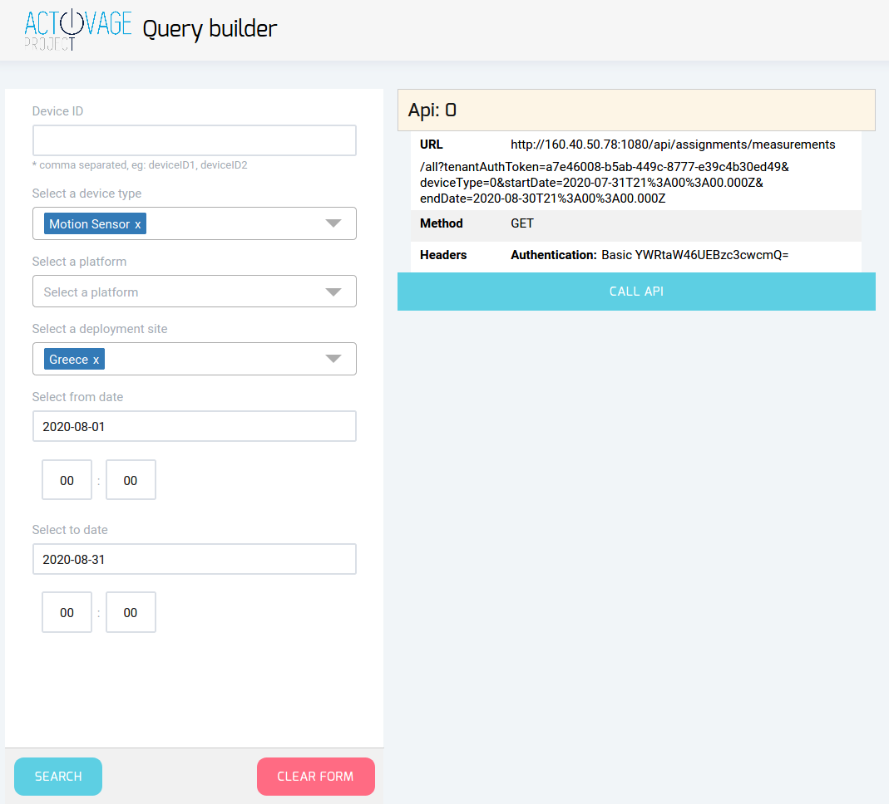

# SIL Query translator 

Query Translator is a tool that allows the developer to view the underlying calls that are made towards the SIL when they submit a query for historical data. Given a query, the tool shows the underlying REST API calls and allows the user to call them individually.

Query translator is based on akveo (akveo.com).

## Build and Deploy

To build the server of Query Translator:
1. Download this repository
2. Set working directory to the downloaded repo
3. Run the following command 
```
npm install
```

To compile and run the server, run the following command.
```
npm start
```

After the successfull compilation, the server will be deployed locally, accessed through http://localhost:4050/

## Deploy with Docker

Before deploying the tool, the file transfer server must be first deployed: https://git.activageproject.eu/Deployment/DT-AIOTES_docker/src/master/Files_Transfer

In order to deploy the Query Translator using Docker, download the `docker-compose.yml` in a local directory. Modify the environment variables and ports to reflect your configuration. Specifically:
* The ***LOGINPATH*** environment variable defines the login address of the file transfer server—e.g., http://localhost:3000/api/activage/login
* The ***TRANFSER_FILES*** environment variable defines the address of the file transfer server—e.g., http://localhost:3000/api/activage
* The ***ANALYTICS_URL*** environment variable defines the address (host and port) of a running instance of AIOTES data analytics component—e.g., https://iti-263.iti.gr:9081/analytics

Then run the following command from the same directory:

```
docker-compose up -d
```

## Usage

Access the webpage of the deployed server. By default, it's on http://localhost:4050/ (if it's build) or http://localhost:4653/ if deployed with docker.

Enter the device details, date range etc. for the wanted query, and press Search. The inputs to the filters will be translated to a query, after the press of ``Search`` button. 

 

## Credits

The software is based on akveo (akveo.com).

## License

```
Copyright 2020 CERTH/ITI Visual Analytics Lab

Licensed under the Apache License, Version 2.0 (the "License");
you may not use this file except in compliance with the License.
You may obtain a copy of the License at

    http://www.apache.org/licenses/LICENSE-2.0

Unless required by applicable law or agreed to in writing, software
distributed under the License is distributed on an "AS IS" BASIS,
WITHOUT WARRANTIES OR CONDITIONS OF ANY KIND, either express or implied.
See the License for the specific language governing permissions and
limitations under the License.
```